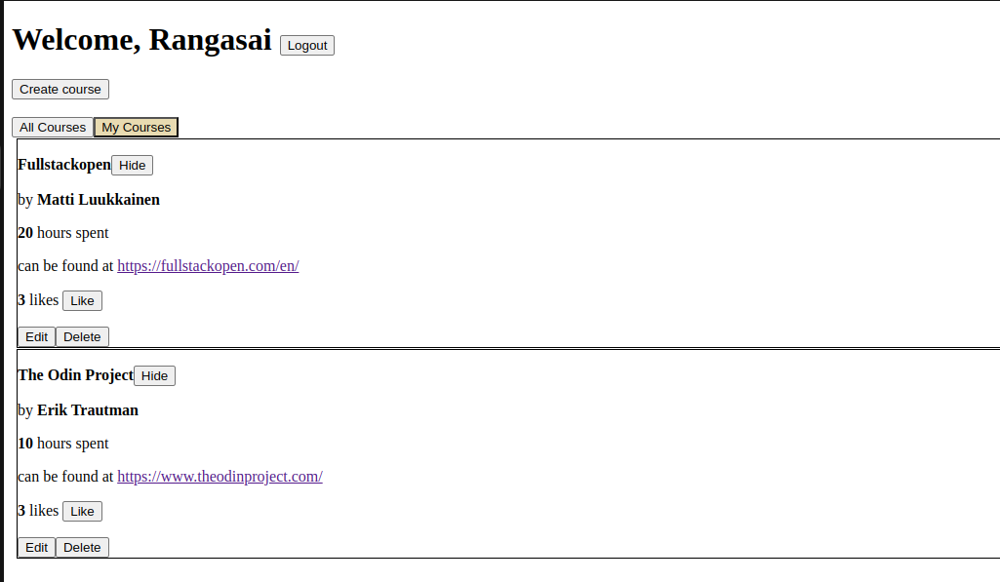

## Course-Tracker
This is an application built to maintain an inventory of courses. It is built using React.js on the frontend and Express.js on the backend, with MongoDB being the database and Mongoose being the ODM. The frontend is built and statically served from the `dist` folder. However, the directory `frontend` also has the development build of the frontend code for purposes of illustration.

The demonstrative version of the application is hosted [here](https://course-tracker-mw6v.onrender.com/)

